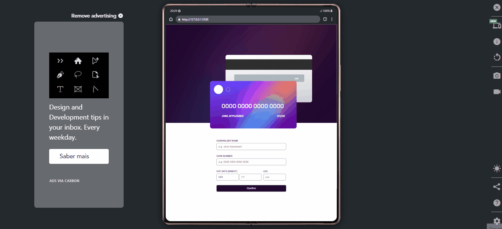

# 🖥️ Formulário de Cartão de Crédito

## 📜 Descrição

Projeto realizado com o objetivo de criar um fomulário de preenchimento de cartão de crédito que conforme a pessoa envia o formulário, aparece do lado uma simulação no desenho do cartão de crédito na tela, para que a pessoa confirme. Logo após aparece uma página de agradecimento.

## ✍️ Processo

- Marcação semântica HTML5
- Propriedades personalizadas de CSS3
- JavaScript
- Flexbox
- Design responsivo
- Validação de Formulário
- Espelho de informações

### ✍️ Validações

- Input de titular do cartão permite somente entrada de letras;
- Input de número do cartão permite somente entrada de números, limitado a 16 dígitos e separados em grupos de 4 números;
- Input de mês permite somente entrada de números, limitado a 2 dígitos, sendo eles entre 1 e 12;
- Input de ano permite somente entrada de números, limitado a 2 dígitos, sendo eles acima do ano atual;
- Input de CVC permite somente entrada de números, limitado a 3 dígitos;
- Todos os input's são validados para não enviar se estiverem vazios e todos estouram uma mensagem de erro caso não esteja entre as validações exigidas;
- Todos os input's espelham as informações simultaneamente para o desenho do cartão de crédito que simula o real.

## 🖱️ A página

> <a href="https://devkarine.github.io/formulario-cartao-credito/" target= "_blank">Acesse a página online</a>

## 👩‍💻 Dev

<table align="center">
  <tr>
    <td align="center">
      

         
          <b> Karine Pereira </b> 
            
            
      

    </td>

  </tr>
</table>
